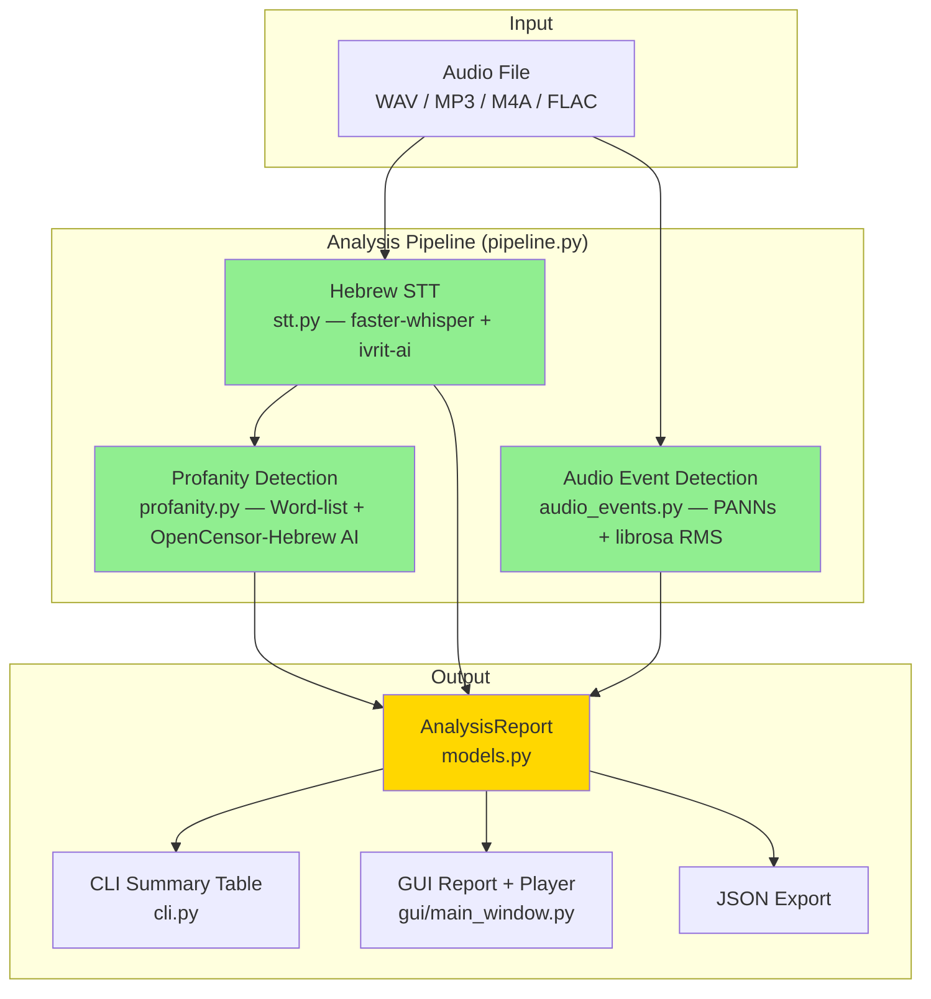

# Child Monitor Analyzer

Analyse Hebrew audio files for profanity, shouting, crying, and other events — with precise timestamps.

## Table of Contents

1. [Overview](#1-overview)
2. [Features](#2-features)
3. [Architecture](#3-architecture)
4. [Installation](#4-installation)
5. [Usage](#5-usage)
   - 5.1 [CLI](#51-cli)
   - 5.2 [GUI](#52-gui)
   - 5.3 [Debug Mode](#53-debug-mode)
6. [Detection Types](#6-detection-types)
7. [Configuration](#7-configuration)
   - 7.1 [Profanity Word Lists](#71-profanity-word-lists)
   - 7.2 [Detection Thresholds](#72-detection-thresholds)
   - 7.3 [Sensitivity Sliders (GUI)](#73-sensitivity-sliders-gui)
8. [Project Structure](#8-project-structure)
9. [File-Level Documentation](#9-file-level-documentation)
   - 9.1 [Core Backend](#91-core-backend)
   - 9.2 [GUI Layer](#92-gui-layer)
   - 9.3 [Build & Entry Points](#93-build--entry-points)
10. [Technology Stack](#10-technology-stack)
11. [Building an Executable](#11-building-an-executable)
12. [Development](#12-development)
13. [Troubleshooting](#13-troubleshooting)
14. [License](#14-license)

---

## 1. Overview

Child Monitor Analyzer is a Python desktop application that analyses Hebrew audio recordings to detect:

- **Profanity** — via curated Hebrew word lists with morphological prefix stripping, plus AI-based sentence-level classification
- **Shouting, screaming, crying** — via pre-trained audio neural networks (PANNs) on Google AudioSet
- **Volume spikes** — via RMS energy analysis

Each detection is pinpointed to an exact timestamp. Results are presented in an interactive GUI with colour-coded report table, full transcript viewer, and integrated audio player, or exported as JSON via the CLI.

---

## 2. Features

| Feature | Description |
|---------|-------------|
| **Hebrew STT** | Word-level transcription using faster-whisper + ivrit-ai Hebrew model |
| **Audio Event Detection** | PANNs SoundEventDetection for shout/cry/scream/laughter classification |
| **Volume Analysis** | librosa RMS energy for detecting abnormally loud sections |
| **Profanity Detection** | Dual-layer: word-list matching (hard + soft tiers) with Hebrew prefix stripping, plus OpenCensor-Hebrew AI model |
| **Interactive GUI** | PySide6 RTL Hebrew desktop application with detection report table |
| **Transcript Viewer** | Full scrollable transcript with interleaved detection markers, click-to-seek, playback highlighting, and text search |
| **Audio Playback** | Integrated player with play/pause, ±10s skip, clickable seek bar, volume control |
| **Event Navigation** | Prev/next event buttons to jump between detections |
| **Play from Detection** | Click any detection row or transcript line to jump to that timestamp |
| **Column Filters** | Excel-style header filter dropdowns for Type and Details columns with persistent settings |
| **Sensitivity Tuning** | Per-detection-type sensitivity sliders that persist across sessions |
| **Parallel Processing** | STT and audio event detection run simultaneously in separate threads |
| **Caching** | Intermediate STT, event, and analysis results are cached to disk |
| **JSON Export** | Full report export with timestamps, types, confidence scores |
| **CLI Interface** | Command-line interface for batch processing and scripting |

---

## 3. Architecture



**Pipeline flow:**

1. **STT** and **Audio Event Detection** run in **parallel** (ThreadPoolExecutor, named threads for diagnosability)
2. When STT completes, **Profanity Detection** runs on the transcription output
3. All detections are **merged, deduplicated**, and sorted by timestamp
4. Results are presented via CLI or GUI

---

## 4. Installation

### 4.1 Prerequisites

- Python 3.10 or higher
- pip

### 4.2 Install from Source

```bash
git clone <repository-url>
cd monitor
pip install -e .
```

### 4.3 Install with Development Tools

```bash
pip install -e ".[dev]"
```

### 4.4 First Run

On first use, the tool will automatically download:
- **ivrit-ai/whisper-large-v3-turbo-ct2** (~1.5 GB) — Hebrew Whisper model
- **PANNs CNN14** (~300 MB) — Audio event detection model
- **OpenCensor-Hebrew** (~500 MB) — AI profanity classifier (optional)

Models are cached locally in `models/` after download.

---

## 5. Usage

### 5.1 CLI

Basic analysis:

```bash
monitor recording.wav
```

Export JSON report:

```bash
monitor recording.wav -o report.json
```

Disable AI profanity classification (faster, word-list only):

```bash
monitor recording.wav --no-ai
```

Verbose logging:

```bash
monitor recording.wav --verbose
```

**CLI output example:**

```
============================================================
  File: recording.wav
  Duration: 05:23
  Speech segments: 42
  Detections: 7
============================================================

  Time      Type             Confidence     Details
  --------------------------------------------------------
  00:45     Profanity        90%            word1, word2
  01:12     Shout            78%            Shout
  02:03     Cry              65%            Crying, sobbing
  03:15     Volume Spike     85%            RMS=0.1234
```

### 5.2 GUI

Launch the graphical interface:

```bash
monitor-gui
```

**GUI workflow:**

1. Click **Open Audio File** to select a recording (or drag-and-drop)
2. Click **Analyse** to start processing — dual progress bars show STT and audio event progress
3. View detections in the colour-coded report table (sortable, filterable)
4. Click the **Play** button on any row to hear the audio from that timestamp
5. Use the transcript panel — detection markers are interleaved with speech segments
6. Click any transcript line or detection marker to jump to that timestamp
7. Use **◄ אירוע קודם** / **אירוע הבא ►** buttons to navigate between detections
8. Adjust detection sensitivity via the sensitivity dialog

### 5.3 Debug Mode

**From source** — run with verbose logging:

```bash
# Windows PowerShell
.\.venv\Scripts\python -c "from monitor.gui.main_window import run_gui; run_gui()" 2>&1

# Or via the CLI with --verbose
monitor recording.wav --verbose
```

**From the built executable:**

```bash
.\dist\monitor-gui\monitor-gui.exe --debug
```

**Log files** are written to:
```
%USERPROFILE%\.child-monitor-analyzer\logs\monitor_YYYYMMDD_HHMMSS.log
```

Log entries include thread names (`[MainThread]`, `[model-load_0]`, `[model-load_1]`) for diagnosing parallel execution. A crash handler (`sys.excepthook`, `threading.excepthook`, Qt message handler) logs unhandled exceptions to the `monitor.crash` logger.

**Environment variables:**

| Variable | Purpose |
|----------|---------|
| `HF_TOKEN` | HuggingFace token to avoid rate limiting during model download |
| `HF_HOME` | Override model download directory (default: `<project>/models/`) |

---

## 6. Detection Types

| Type | Hebrew Label | Detection Method | Colour |
|------|-------------|-----------------|--------|
| Profanity | ניבול פה | Word-list + AI | Red |
| Shout | צעקה | PANNs AudioSet | Orange |
| Scream | צרחה | PANNs AudioSet | Dark Orange |
| Cry | בכי | PANNs AudioSet | Blue |
| Wail | יללה | PANNs AudioSet | Blue |
| Baby Cry | בכי תינוק | PANNs AudioSet | Purple |
| Laughter | צחוק | PANNs AudioSet | Green |
| Volume Spike | עוצמה חריגה | RMS Energy | Grey |

---

## 7. Configuration

### 7.1 Profanity Word Lists

The tool uses two tiers of Hebrew profanity word lists located in the `data/` directory:

| File | Purpose |
|------|---------|
| `data/he_profanity.txt` | **Hard profanity** — severe/explicit words that should always be flagged |
| `data/he_profanity_soft.txt` | **Soft profanity** — milder words, insults, and child-sensitive language |

**Format:** One word per line. Lines starting with `#` are comments.

**Hebrew morphology:** The detector automatically strips common Hebrew prefixes
(ב, ל, מ, כ, ה, ו, ש, וב, ול, etc.) before matching, so prefixed forms are
detected automatically.

### 7.2 Detection Thresholds

| Parameter | Default | Description |
|-----------|---------|-------------|
| PANNs confidence threshold | 0.3 | Minimum probability for audio event detection |
| Minimum event duration | 0.5s | Events shorter than this are discarded |
| Volume spike percentile | 95th | RMS values above this percentile are flagged |
| AI profanity threshold | 0.5 | Minimum OpenCensor-Hebrew probability |

### 7.3 Sensitivity Sliders (GUI)

The GUI provides a sensitivity dialog with per-detection-type sliders. Slider position maps inversely to a confidence threshold:

- **Left** = Low sensitivity (high threshold = fewer detections)
- **Right** = High sensitivity (low threshold = more detections)

Settings persist across sessions via `QSettings`.

---

## 8. Project Structure

```
monitor/
├── pyproject.toml                          # Project config, dependencies, entry points
├── README.md                               # This file
├── monitor-gui.spec                        # PyInstaller spec for building .exe
├── .gitignore                              # Git ignore rules
├── data/
│   ├── he_profanity.txt                    # Hard profanity word list
│   └── he_profanity_soft.txt               # Soft profanity word list
├── docs/
│   └── README.html                         # HTML copy of documentation
└── src/
    ├── run_gui.py                          # Standalone GUI entry point (PyInstaller)
    └── monitor/
        ├── __init__.py                     # Package root, version string
        ├── __main__.py                     # python -m monitor entry point
        ├── models.py                       # Data models: DetectionType, Detection, AnalysisReport
        ├── model_cache.py                  # ML model directory management + download helpers
        ├── stt.py                          # Hebrew STT (faster-whisper + ivrit-ai)
        ├── audio_events.py                 # PANNs SED + librosa RMS volume detection
        ├── profanity.py                    # Word-list + AI profanity detection
        ├── pipeline.py                     # Pipeline orchestrator (parallel execution)
        ├── cli.py                          # CLI entry point (argparse)
        └── gui/
            ├── __init__.py                 # GUI sub-package
            ├── main_window.py              # Main window, QThread worker, progress bars
            ├── audio_player.py             # Audio player with seek, skip, event navigation
            ├── report_table.py             # Detection table with filters + play buttons
            ├── transcript_widget.py        # Transcript viewer with search + detection markers
            ├── sensitivity_panel.py        # Per-type sensitivity sliders dialog
            ├── strings.py                  # Centralised UI string table (Hebrew + English)
            └── player_icons.py             # Programmatic vector icons for player controls
```

---

## 9. File-Level Documentation

### 9.1 Core Backend

#### `src/monitor/__init__.py`
**Purpose:** Package root that declares the Child Monitor Analyzer package and exposes the version string.
**Data Flow:** None — metadata only.

#### `src/monitor/__main__.py`
**Purpose:** Enables running the package via `python -m monitor` by delegating to `cli.main()`.
**Data Flow:** Command-line args → `cli.main()`.

#### `src/monitor/models.py`
**Purpose:** Core data models — enums, dataclasses, and constants shared across the entire project for detection results, transcription segments, and analysis reports.
**Architecture:** Dependency-free foundation module imported by all other modules.
**Public API:** `DetectionType`, `DETECTION_LABELS_HE`, `AUDIOSET_CLASS_MAP`, `TranscribedWord`, `TranscribedSegment`, `Detection`, `AnalysisReport`
**Data Flow:** Other modules produce `TranscribedSegment` and `Detection` objects → aggregated into `AnalysisReport` → serialized to/from JSON via `to_dict()` / `from_dict()` / cache methods.

#### `src/monitor/model_cache.py`
**Purpose:** Portable model directory management — ensures all ML model downloads (HuggingFace, PANNs) go into a local `models/` folder. Handles PANNs checkpoint downloading with resume support. Supports both development and PyInstaller frozen modes.
**Public API:** `get_project_root`, `get_models_dir`, `get_hf_home`, `get_panns_dir`, `setup_model_environment`, `ensure_panns_ready`
**Data Flow:** Environment variables (`HF_HOME`) are set → model downloads are redirected to `<project_root>/models/` → checkpoint paths returned to callers.

#### `src/monitor/stt.py`
**Purpose:** Hebrew speech-to-text transcription using faster-whisper with the ivrit-ai Hebrew fine-tuned Whisper model, producing word-level and segment-level timestamps. Includes a `tqdm` subclass that tracks HuggingFace Hub's single-tqdm reuse pattern for accurate download progress reporting.
**Architecture:** Depends on `models`, `model_cache`, `gui.strings`. Called by `pipeline`.
**Public API:** `HebrewSTT`
**Data Flow:** Audio file path → faster-whisper CTranslate2 inference → `List[TranscribedSegment]` with word-level timestamps.

#### `src/monitor/audio_events.py`
**Purpose:** Non-speech audio event detection — identifies shouting, crying, screaming, laughter via PANNs (Pre-trained Audio Neural Networks) and volume spikes via librosa RMS energy analysis. Supports GPU (CUDA/XPU) and CPU.
**Architecture:** Depends on `model_cache`, `models`, `gui.strings`. Called by `pipeline`.
**Public API:** `AudioEventDetector`
**Data Flow:** Audio file → PANNs SoundEventDetection (frame-level probabilities for 527 AudioSet classes) + librosa RMS analysis → filtered/merged `List[Detection]`.

#### `src/monitor/profanity.py`
**Purpose:** Hebrew profanity detection using a dual-layer approach: (1) word-list matching with morphological prefix stripping for common Hebrew prefixes, and (2) AI classification via the OpenCensor-Hebrew AlephBERT model.
**Architecture:** Depends on `models`. Uses curated word lists from `data/`. Called by `pipeline` after STT completes.
**Public API:** `ProfanityDetector`
**Data Flow:** `List[TranscribedSegment]` → word-list matching + optional AI classification → `List[Detection]` of type PROFANITY.

#### `src/monitor/pipeline.py`
**Purpose:** Pipeline orchestrator that coordinates the three analysis stages (STT, audio events, profanity) with parallel execution via `ThreadPoolExecutor`, progress reporting, intermediate caching, and deduplication. Threads are named (`model-load_0`, `model-load_1`) for log diagnosability.
**Architecture:** Central coordinator importing `HebrewSTT`, `AudioEventDetector`, `ProfanityDetector`, and `model_cache`. Called by `cli` and `gui.main_window`.
**Public API:** `AnalysisPipeline`
**Data Flow:** Audio file path → parallel (STT → segments, PANNs → event detections) → profanity detection on segments → deduplicated merged `AnalysisReport` → cached to disk.

#### `src/monitor/cli.py`
**Purpose:** Command-line interface for analysing Hebrew audio files — parses arguments, runs the pipeline, and prints a formatted detection report to the console.
**Architecture:** Depends on `models` and `pipeline`. Entry point registered via `pyproject.toml` console_scripts.
**Public API:** `parse_arguments`, `main`
**Data Flow:** CLI args (audio path, options) → `AnalysisPipeline.analyze()` → console table + optional JSON export.

### 9.2 GUI Layer

#### `src/monitor/gui/__init__.py`
**Purpose:** GUI sub-package declaration.
**Data Flow:** None — package marker only.

#### `src/monitor/gui/main_window.py`
**Purpose:** Top-level PySide6 main window — provides file picker, drag-and-drop, recent files history, dual progress bars for parallel model downloads, and wires together all GUI widgets. Includes crash handlers (`sys.excepthook`, `threading.excepthook`, Qt message handler) and comprehensive instrumentation.
**Architecture:** Depends on `pipeline`, `models`, `model_cache`, and all sibling GUI widgets. Runs analysis in a background `QThread` via `_AnalysisWorker`.
**Public API:** `MainWindow`, `run_gui`
**Data Flow:** User selects audio file → `_AnalysisWorker` runs `AnalysisPipeline.analyze()` in background → signals update progress bars → `AnalysisReport` populates report table, transcript, and audio player.

#### `src/monitor/gui/audio_player.py`
**Purpose:** Integrated audio playback widget with play/pause, ±10s skip, clickable seek bar (custom `_ClickableSlider` subclass), volume control, and prev/next event navigation buttons. RTL-aware button layout.
**Architecture:** Uses PySide6 `QMediaPlayer` + `QAudioOutput`. Receives `seek_to` from report table play buttons; emits `position_changed` for playback-position highlighting.
**Public API:** `AudioPlayerWidget`
**Data Flow:** Audio file path → `QMediaPlayer` playback → `position_changed(seconds)` signal; event times list → prev/next event navigation via `bisect`.

#### `src/monitor/gui/report_table.py`
**Purpose:** Interactive detection results table with colour-coded rows by type, play buttons per row, Excel-style column header filter dropdowns (with search, select-all, persistent settings), sortable columns, and bold+amber playback highlighting.
**Architecture:** Depends on `models` and `gui.strings`. Contains `FilterPopup` widget and `_FilterHeaderView` custom header. Custom header intercepts clicks on filterable columns (Type, Details) for filter popups while passing non-filterable columns (Time, Confidence) through for sorting.
**Public API:** `ReportTableWidget`, `FilterPopup`
**Data Flow:** `AnalysisReport` → table rows with colour/play buttons → filter dropdowns control visibility → `play_requested(seconds)`, `filter_changed`, `events_changed` signals.

#### `src/monitor/gui/transcript_widget.py`
**Purpose:** Scrollable transcript viewer that displays STT segments interleaved with colour-coded detection markers (with emoji icons), with click-to-seek, playback-position highlighting (covers both speech segments and audio event markers), and full-text search with prev/next match navigation.
**Architecture:** Depends on `models` and `gui.strings`. Emits `play_requested`; receives `highlight_time` from audio player position updates.
**Public API:** `TranscriptWidget`
**Data Flow:** `List[TranscribedSegment]` + `List[Detection]` → rich-text blocks with timestamps and emoji markers → click emits `play_requested(seconds)`; playback position → amber-highlighted block with auto-scroll.

#### `src/monitor/gui/sensitivity_panel.py`
**Purpose:** Dialog with per-detection-type sensitivity sliders that map inversely to confidence thresholds (left = fewer detections, right = more detections). Settings persist via `QSettings`.
**Architecture:** Depends on `models` and `gui.strings`. Opened from main window.
**Public API:** `SensitivityDialog`
**Data Flow:** Slider positions ↔ confidence thresholds (0.02–0.50) → `thresholds_changed` signal → main window re-filters detections.

#### `src/monitor/gui/strings.py`
**Purpose:** Centralised UI string table for internationalisation — all user-facing text (Hebrew + English) is defined here, selected by the active language setting.
**Architecture:** Dependency-free; imported by every GUI module and some backend modules.
**Public API:** `Lang`, `S`, `tr`, `set_language`
**Data Flow:** String key + current language → localised text string via `tr(S.KEY)`.

#### `src/monitor/gui/player_icons.py`
**Purpose:** Programmatically drawn vector icons for the audio player controls (play, pause, skip-back, skip-forward, volume) using QPainter, ensuring consistent style without external image assets.
**Architecture:** Dependency-free (PySide6 only). Imported by `audio_player`.
**Public API:** `icon_play`, `icon_pause`, `icon_skip_back`, `icon_skip_forward`, `icon_volume`
**Data Flow:** None → returns `QIcon` objects drawn on `QPixmap` canvases.

### 9.3 Build & Entry Points

#### `src/run_gui.py`
**Purpose:** Standalone entry point script for launching the GUI, used by both PyInstaller and direct `python src/run_gui.py` execution.
**Data Flow:** Script invocation → `run_gui()`.

#### `monitor-gui.spec`
**Purpose:** PyInstaller spec file defining how to bundle the GUI into a one-directory distributable. Includes hidden imports for all ML/audio dependencies, bundled data files (profanity word lists, libsndfile DLL), and exclusions for unused packages. Models are NOT bundled — they download at first run.
**Data Flow:** Source tree → PyInstaller Analysis/PYZ/EXE/COLLECT → `dist/monitor-gui/`.

---

## 10. Technology Stack

| Component | Library | Version | License | Purpose |
|-----------|---------|---------|---------|---------|
| Hebrew STT | faster-whisper | >= 1.0 | MIT | CTranslate2 Whisper engine, 4x faster |
| Hebrew Model | ivrit-ai/whisper-large-v3-turbo-ct2 | — | Apache-2.0 | Hebrew fine-tuned Whisper (5000+ hrs) |
| Audio Events | panns_inference | >= 0.1 | MIT | Google AudioSet 527-class detection |
| Volume Analysis | librosa | >= 0.10 | ISC | RMS energy computation |
| Profanity AI | OpenCensor-Hebrew (AlephBERT) | — | Attribution | Hebrew profanity classification |
| ML Framework | PyTorch | >= 2.0 | BSD | Neural network runtime |
| NLP | transformers | >= 4.30 | Apache-2.0 | HuggingFace model loading |
| GUI Framework | PySide6 | >= 6.5 | LGPL-3.0 | RTL Hebrew desktop application |
| Audio Format | PyAV (bundled) | — | Apache-2.0 | Audio format decoding |

---

## 11. Building an Executable

Build a standalone `.exe` using PyInstaller:

```bash
pip install -e ".[dev]"
pyinstaller --noconfirm monitor-gui.spec
```

The executable and all dependencies will be in `dist/monitor-gui/`.

> **Note:** The first run will still download ML models (~1.8 GB total) unless
> you pre-bundle them. See the PyInstaller spec file for model bundling options.

Alternatively, build without the spec file:

```bash
pyinstaller --name monitor-gui \
            --onedir \
            --windowed \
            --add-data "data;data" \
            --hidden-import monitor.gui \
            --hidden-import monitor.gui.main_window \
            --hidden-import monitor.gui.report_table \
            --hidden-import monitor.gui.audio_player \
            src/run_gui.py
```

---

## 12. Development

### 12.1 Run Tests

```bash
pytest
```

### 12.2 Run from Source

```bash
# Activate virtual environment
python -m venv .venv
.\.venv\Scripts\Activate.ps1   # Windows PowerShell
# or: source .venv/bin/activate  # Linux/macOS

# Install in editable mode
pip install -e .

# Launch GUI
python -c "from monitor.gui.main_window import run_gui; run_gui()"

# Or via CLI
monitor recording.wav
```

### 12.3 Code Style

This project follows:
- [PEP 8](https://peps.python.org/pep-0008/) — code style
- [Google Python Style Guide](https://google.github.io/styleguide/pyguide.html) — docstrings
- Type hints on all function signatures
- `logging` module for all diagnostic output (never `print()`)
- Thread names for log diagnosability (`[model-load_0]`, `[model-load_1]`)

---

## 13. Troubleshooting

| Issue | Solution |
|-------|----------|
| **Model download fails / rate limited** | Set `HF_TOKEN` environment variable with a HuggingFace token. Avoid deleting `models/` between runs. |
| **WinError 1314 (symlink privilege)** | The tool falls back to file copies automatically. No action needed. |
| **CUDA out of memory** | The tool auto-detects GPU availability. Set `CUDA_VISIBLE_DEVICES=""` to force CPU. |
| **No audio playback** | Ensure FFmpeg libraries are available. PySide6 bundles FFmpeg on most platforms. |
| **Progress bar shows >100%** | Fixed in current version. If using an old build, rebuild the executable. |

---

## 14. License

MIT License. See [LICENSE](LICENSE) for full text.

Third-party dependencies have their own licenses — see §10 Technology Stack.
